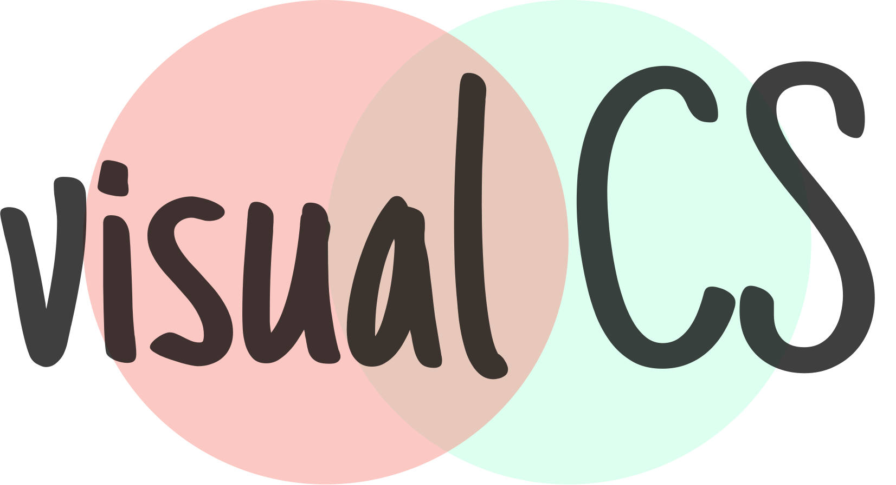

</img>

<b>an Open Source project</b>

### Introduction

**_visual CS aims to make learning CS more fun and easy by challenging the programmers to write code that visualises the algorithms, datastructures and many other concepts._**

**Idea** is to visualize all the possible algorithms, data structures in javascript. So, to visualize in javascript will challenge the programmers and this will help CS students to learn visually and also they can look the code and learn from it.

We will create the platform with React. And once the platform is ready, any programmer or developer can contribute.

Any one who can code can contribute to the project. Since we all want everything to be clear, before one can start contributing,it is important to insert our name in the list of contributors, so we can keep track of every contributor.
